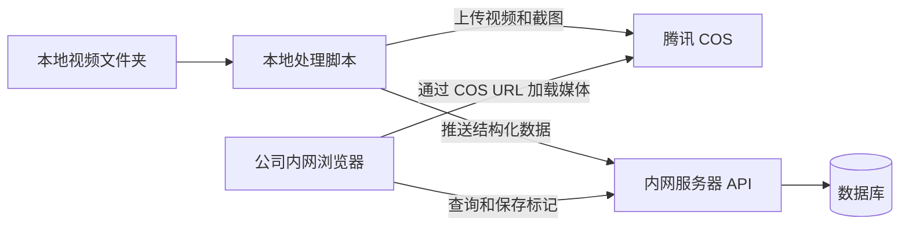

# 视频走查系统服务器资源与配合诉求

## 1. 建设目标

在现有本地视频处理工具基础上，增加一套公司内网可访问的视频走查服务。

本地脚本继续负责：

- 扫描本地视频。
- 获取视频时长、分辨率、文件大小等元数据。
- 按规则生成 2 至 3 张原分辨率截图。
- 上传视频和截图到腾讯 COS。
- 计算视频 SHA-256 唯一 ID，避免重复导入。
- 将视频结构化数据和 COS URL 推送到服务器。

服务器负责：

- 托管视频走查页面。
- 接收本地脚本推送的结构化数据。
- 保存视频记录、评级、质检备注和补充。
- 提供查询、筛选和 CSV 导出功能。
- 提供登录或必要的内网访问控制。
- 负责数据库备份、运行日志和服务自动恢复。

服务器不保存视频和截图，不执行视频转码或截帧，因此不需要按媒体总容量配置磁盘和带宽。

## 2. 系统架构



腾讯 COS 的账号、权限、存储桶、访问 URL 和相关配置由业务侧自行解决，不需要服务器技术同学配合。

## 3. 访问方式

首期只要求公司内网访问，不需要申请固定域名。

可直接提供服务器内网 IP 和端口，例如：

```text
http://10.x.x.x:8080
```

推荐由 Nginx 监听统一端口并转发到应用服务：

```text
浏览器 -> 服务器内网 IP:80/8080 -> Nginx -> 应用 API
```

需要技术确认：

- 提供可被目标办公网络访问的固定内网 IP。
- 开放页面访问端口，建议使用 `80`、`8080` 或公司指定端口。
- 开放本地运行脚本到导入 API 的网络链路。
- 如有防火墙或安全组，仅允许公司内网网段访问。
- 确认服务器 IP 是否可能变化；如果可能变化，需要提供稳定的内网访问入口。

内网首期可以使用 HTTP。如果公司安全规范要求 HTTPS，可由技术配置内网证书，但不作为本项目首期资源申请的硬性条件。

## 4. 页面功能

服务器托管的页面需要支持：

- 按一级地址筛选。
- 按二级地址筛选。
- 按视频名称搜索。
- 按批次筛选。
- 按创建日期范围筛选。
- 按评级筛选。
- 查看视频 COS URL。
- 查看截图，并支持上一张和下一张切换。
- 填写并保存评级、质检备注和补充。
- 导出当前筛选条件下的数据为 CSV。

CSV 只包含结构化字段、视频 URL 和截图 URL，不包含 Base64 图片、图片文件或视频文件。

## 5. API 能力

### 5.1 批量导入

本地脚本需要调用批量导入接口，例如：

```http
POST /api/videos/import
Authorization: Bearer <IMPORT_TOKEN>
Content-Type: application/json
```

建议支持一次提交多条记录，并以视频 SHA-256 唯一 ID 实现幂等导入。重复提交同一视频时不得重复新增。

单条数据示例：

```json
{
  "video_id": "视频文件SHA-256",
  "level_1": "W33",
  "level_2": "小学数学",
  "batch": "2026-08-17",
  "created_date": "2026-08-17",
  "file_name": "同步课.mp4",
  "file_size": 123456789,
  "duration": 368.5,
  "width": 3840,
  "height": 2160,
  "video_url": "https://COS地址/video.mp4",
  "snapshots": [
    {
      "sequence": 1,
      "second": 3,
      "url": "https://COS地址/snapshot-1.jpg"
    }
  ]
}
```

接口返回建议包含：

- 新增数量。
- 已存在数量。
- 更新数量。
- 失败记录及失败原因。
- 对应的服务端记录 ID。

### 5.2 列表查询

建议提供：

```http
GET /api/videos
```

支持以下查询参数：

```text
level_1
level_2
batch
created_from
created_to
rating
keyword
page
page_size
```

建议由服务器进行筛选和分页，避免数据长期累计后由浏览器一次加载全部记录。

### 5.3 保存质检结果

建议提供：

```http
PATCH /api/videos/{video_id}/review
Content-Type: application/json
```

请求示例：

```json
{
  "rating": "合格",
  "review_note": "质检备注",
  "supplement": "补充"
}
```

评级枚举：

```text
未评级、优秀、良好、合格、不合格
```

建议同时记录修改人、修改时间和数据版本，避免多人同时编辑造成覆盖。

### 5.4 CSV 导出

数据量较小时，可以继续由浏览器根据当前可见行生成 CSV。

数据量较大时，建议提供：

```http
GET /api/videos/export.csv
```

该接口使用与列表查询相同的筛选参数，只导出筛选后的记录。

## 6. 数据库需求

推荐使用 PostgreSQL。若公司已有统一的 MySQL 或 PostgreSQL 服务，也可以直接使用现有数据库资源。

建议数据结构：

- `videos`：视频基础信息、一级地址、二级地址、批次、创建日期、视频 URL 和元数据。
- `snapshots`：截图顺序、截图秒数和截图 URL。
- `reviews`：评级、质检备注、补充、修改人和修改时间。
- `users`：如需独立登录，保存用户和角色。
- `audit_logs`：可选，保存人工修改历史。

必要约束和索引：

- `video_id` 设置唯一索引，用于幂等导入和去重。
- 为 `level_1`、`level_2`、`batch`、`created_date` 和 `rating` 建立查询索引。
- 数据库字符集使用 UTF-8。
- 时间统一使用北京时间，或保存带时区时间。

## 7. 服务器配置建议

由于媒体不经过服务器，系统属于轻量级 Web 和数据库应用。

### 7.1 试运行最低配置

```text
CPU：1 核
内存：2 GB
系统盘：30 至 40 GB SSD
网络：公司内网可访问
操作系统：Linux
```

适合少量用户、少量记录的功能验证。

### 7.2 建议正式配置

```text
CPU：2 核
内存：4 GB
系统盘：50 GB SSD
网络：公司内网可访问，提供固定内网 IP
操作系统：Linux
数据库：PostgreSQL 或公司现有数据库
反向代理：Nginx
部署方式：Docker Compose 或 systemd
```

在记录量不超过数万条、同时使用人数较少的情况下，`2 核 4 GB` 足够使用。

服务器磁盘主要保存：

- 数据库数据。
- 应用程序和部署文件。
- 运行日志。
- 数据库备份。

服务器不保存视频和截图，因此无需按照视频数量扩容磁盘。

## 8. 部署环境

优先建议支持 Docker Compose，便于统一部署应用、Nginx 和数据库连接配置。

如果公司不允许 Docker，也可以使用 systemd 管理应用进程。

技术需要提供或确认：

- Linux 服务器登录和部署权限，或由技术代为部署。
- Python 或最终选定的应用运行环境。
- Nginx。
- PostgreSQL/MySQL 数据库地址、数据库名和应用账号。
- 应用配置和密钥的安全保存方式，例如环境变量或服务器配置文件。
- 服务开机启动和异常自动重启机制。

## 9. 安全要求

建议至少具备：

- 只允许公司内网访问服务器页面和 API。
- 数据库端口不向办公网络或公网开放，只允许应用服务器访问。
- 本地导入脚本使用独立 Token，不使用人工登录密码。
- 导入 Token 和数据库密码通过环境变量保存，不写入代码仓库。
- 导入接口限制请求体大小，例如 `5 MB`，因为只传 JSON。
- 对接口进行基础限流并记录失败日志。
- 对评级、备注和补充做长度限制和 HTML 转义。
- CSV 导出防止公式注入，以 `= + - @` 开头的文本需要转义。

如需要区分权限，建议角色为：

- 质检员：查看数据、填写评级和质检备注。
- 领导：查看数据、填写补充。
- 管理员：管理记录和账号。

如果公司内网已有统一身份认证，可后续接入；首期也可以使用简单账号密码，或在访问范围足够受控时采用统一共享账号。

## 10. 备份和运维

需要技术配合：

- 数据库每天自动备份。
- 备份至少保留 7 至 30 天。
- 定期验证备份可以恢复。
- 应用日志按天轮转，防止占满磁盘。
- 应用异常退出后自动重启。
- 提供健康检查接口，例如 `GET /health`。
- 记录导入失败、保存失败和服务端异常。
- 应用升级时不得覆盖数据库数据和服务配置。

## 11. 需要技术确认的事项

1. 能否提供 `2 核 4 GB、50 GB SSD` 的 Linux 内网服务器。
2. 能否提供稳定的内网 IP，以及页面和 API 使用的端口。
3. 本地运行脚本所在电脑能否访问该服务器 API。
4. 是否有可直接使用的 PostgreSQL 或 MySQL 服务。
5. 是否支持 Docker Compose；如不支持，采用何种应用部署方式。
6. 是否有公司统一登录系统；首期是否允许简单账号登录。
7. 是否要求记录评级、质检备注和补充的完整修改历史。
8. 数据库备份由谁负责，备份保留周期是多少。
9. 预计同时使用人数、记录总量和每日新增量。
10. 是否需要单独的测试环境；若没有，如何完成上线前验证。

不需要技术确认：

- 腾讯 COS 存储桶、访问权限、CORS、上传密钥和对象生命周期。
- 公网域名及公网访问。
- 视频和截图存储空间。
- 视频转码和截图计算资源。

## 12. 可直接发送给技术的简版诉求

> 需要部署一套公司内网使用的轻量视频走查 Web 服务。视频和截图由本地脚本处理并上传腾讯 COS，COS 相关事项由业务侧自行负责；服务器不保存、不转码媒体，仅托管页面、提供 API 并保存结构化数据和质检结果。
>
> 首期不需要固定域名和公网访问，可以通过固定内网 IP 加端口访问。建议提供一台 `2 核 4 GB、50 GB SSD` 的 Linux 服务器，以及 PostgreSQL 或公司现有数据库。部署方式优先使用 Docker Compose，也可以使用 Nginx 加 systemd。
>
> 服务需要提供批量幂等导入、列表筛选、评级与备注保存和 CSV 导出能力。本地脚本通过独立 Token 推送一级地址、二级地址、批次、创建日期、视频元数据、视频 COS URL 和截图 COS URL，视频 SHA-256 用作去重标识。
>
> 请协助确认内网 IP 和端口、网络连通性、数据库资源、部署方式、访问认证、自动备份、日志轮转和服务自动重启。媒体由浏览器直接通过 COS URL 加载，因此服务器不需要大容量磁盘或高带宽。
